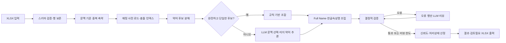

# 컬럼코멘트 없는 컬럼 한글화 에이전트 개발 계획

## 1. 목적

`data/table_column_template_컬럼코멘트N.xlsx`의 영문 컬럼명을
`meta_ai_kor/result.xlsx`의 영문 약어·Full Name·한글단어 매핑과 테이블 문맥을
이용해 영문 Full Name과 공백 없는 한글속성명으로 변환하는 FastAPI 에이전트를
개발한다.

결과 생성은 사람 승인 없이 끝까지 자동 수행한다. 개발 품질은 별도의 AI 리뷰와
블라인드 사람 리뷰로 평가하며, 각 stage commit을 두 리뷰 점수에 연결해 목표
점수에 도달할 때까지 개선한다.

## 2. 확정된 요구사항

- 운영 형태: `meta_ai_mapping`과 같은 FastAPI 기반 서비스
- API 형태: 단일 요청과 비동기 작업·진행률 스트리밍을 모두 제공
- 입력 데이터: `data/table_column_template_컬럼코멘트N.xlsx`
- 매핑 사전: `meta_ai_kor/result.xlsx`
- LLM: 기존 로컬 LLM 설정인 `Qwen3.6-27B-FP8`과 엔드포인트를 재사용
- 한글속성명: 의미 단어를 공백 없이 결합
- 결과 컬럼: 원본 12개 컬럼을 보존하고 다음 컬럼을 추가
  - `영문 Full Name`
  - `한글속성명`
  - `처리상태`
  - `신뢰도`
  - `변환근거`
- 불확실한 항목: 결과는 생성하되 `검토필요`로 표시하고 별도 시트에도 복제
- 사람 승인: 결과 생성의 선행 조건으로 사용하지 않음
- 신규 추론 매핑: 별도 사전으로 저장하거나 `result.xlsx`에 자동 반영하지 않음
- 완료 기준: 전체 행 결과 생성, 자동 검증 오류 0건, 검토필요 비율 보고

## 3. 입력 데이터 기준선

2026-07-31 기준 분석 결과는 다음과 같다.

| 항목 | 값 | 설계 영향 |
|---|---:|---|
| 입력 데이터 행 | 694 | 모든 행의 순서와 값을 보존해야 함 |
| 고유 컬럼명 | 608 | AI 의미 리뷰의 기본 전체 모집단 |
| 중복 컬럼명 종류 | 43 | 컬럼명만으로 중복 제거하면 안 됨 |
| 빈 컬럼설명 | 692 | 컬럼설명 의존 생성은 사용할 수 없음 |
| 고유 테이블명 | 11 | 테이블명·설명을 보조 문맥으로 사용 |
| 빈 테이블설명 | 248 | 테이블 문맥도 항상 존재하지는 않음 |
| 매핑 행 | 838 | 중복 없는 원본 매핑 전체를 로드 |
| 고유 영문약어 | 746 | 후보 사전의 기본 키 |
| 한글 의미가 여러 개인 약어 | 75 | 문맥 기반 의미 선택 필요 |
| Full Name이 여러 개인 약어 | 46 | 단순 다수결 사용 금지 |
| 밑줄 토큰 직접 매핑 완료 행 | 321 | 직접 치환만으로는 부족 |
| 사전 기반 복합 분해 가능 행 | 475 | 동적 분해와 모호성 해소 필요 |
| 복합 분해가 모호한 행 | 378 | 후보 점수와 LLM 선택 필요 |
| 한글 의미가 모호한 행 | 396 | LLM 의미 판별과 검증 필요 |

대표 충돌은 `DT`의 DATE/DAY/DETAIL, `CR`의 CAR/CONTRACT/CREATION,
`AP`의 APPLICATION/APPROVAL이다. 따라서 “가장 긴 약어 하나” 또는
“출현건수 1위”만 선택하는 규칙은 사용할 수 없다.

## 4. 목표와 비목표

### 목표

- 모든 입력 행에 영문 Full Name과 한글속성명을 생성한다.
- 동일한 문맥의 동일 컬럼은 일관된 결과를 낸다.
- 컬럼명 내부 약어를 최대한 사전 근거로 분해한다.
- 사전으로 해결되지 않는 부분만 LLM이 문맥으로 추론한다.
- 결과마다 사용한 분해·매핑·추론 근거를 추적할 수 있게 한다.
- 검증 실패 항목만 제한적으로 LLM 리뷰를 반복한다.
- stage commit마다 재현 가능한 AI·사람 리뷰 점수를 남긴다.

### 비목표

- 생성 과정에서 사람 승인을 기다리는 워크플로
- 추론 결과를 매핑 사전에 자동 학습하거나 덮어쓰는 기능
- 원본 입력 데이터의 수정
- 컬럼코멘트가 있는 파일의 재처리
- 업무 표준용어 사전 관리 화면

## 5. 결과 XLSX 규격

### `한글속성명_결과` 시트

원본 12개 컬럼을 같은 순서와 서식으로 보존하고 뒤에 5개 컬럼을 추가한다.

| 추가 컬럼 | 형식 | 예시 |
|---|---|---|
| 영문 Full Name | 의미 단위별 영문 원형을 공백으로 결합 | `FINAL LOAD DATE TIME` |
| 한글속성명 | 한글 의미 단위를 공백 없이 결합 | `최종적재일시` |
| 처리상태 | `자동확정`, `검토필요`, `검증실패` | `자동확정` |
| 신뢰도 | 0~100 정수 | `92` |
| 변환근거 | 약어→Full Name→한글단어 연결 | `FNL→FINAL→최종 \| DT→DATE→일자` |

`영문 Full Name`은 사전 또는 LLM이 선택한 의미 단위를 컬럼명 순서대로 결합한다.
`한글속성명`은 같은 순서의 한글단어를 공백 없이 결합한 후 최소한의 자연어
정규화를 적용한다.

### `검토필요` 시트

`처리상태`가 `검토필요` 또는 `검증실패`인 행만 복제한다. 결과 생성은 성공으로
완료되며 이 시트의 존재가 다운로드를 막지 않는다. 검토 사유와 추천 확인 포인트를
추가한다.

별도의 `신규매핑후보` 시트는 만들지 않는다.

## 6. 처리 아키텍처



### 처리 원칙

1. 규칙으로 확정할 수 있는 작업을 먼저 수행한다.
2. LLM에는 전체 사전이 아니라 해당 컬럼의 후보와 충돌 정보만 전달한다.
3. 같은 입력·설정에서는 같은 결과가 나오도록 정렬, 동률 해소, 프롬프트 출력을
   결정적으로 만든다.
4. LLM 생성과 LLM 리뷰는 프롬프트와 상태를 분리한다.
5. 오류가 없는 행은 리뷰 라운드에서 다시 생성하지 않는다.

## 7. 핵심 처리 상세

### 7.1 입력 및 중복 처리

- 헤더의 `(*)`, 공백 차이를 정규화한다.
- `컬럼명`, `테이블명`, `테이블설명`, `데이터타입`, `컬럼순번`을 문맥으로 읽는다.
- 원본 Excel 행 번호를 `source_id`로 사용한다.
- 중복 축약 키는 단순 컬럼명이 아니라 다음 문맥 키를 사용한다.

```text
(컬럼명, 테이블명, 테이블설명, 데이터타입)
```

문맥 키가 완전히 같은 항목만 한 번 생성한 뒤 원본 행으로 복제한다. 동일 컬럼명이
서로 다른 테이블에 존재하면 독립적으로 해석한다.

### 7.2 매핑 사전 인덱스

다음 조회 구조를 메모리에 만든다.

- `영문약어 → [(Full Name, 한글단어, 출현건수)]`
- `영문약어 + Full Name → 한글단어 후보`
- `영문약어 + 한글단어 → Full Name 후보`
- 다의 약어와 Full Name 충돌 약어 집합

출현건수는 동률 해소의 보조 신호일 뿐 의미 선택의 단독 기준으로 사용하지 않는다.

### 7.3 약어 후보 분해

1. 밑줄을 1차 경계로 분리한다.
2. 각 토큰에 대해 사전 약어 기반 동적 계획법으로 가능한 모든 완전 분해를 구한다.
3. `DTHMS → DT + HMS`, `ORGCD → ORG + CD`처럼 붙은 복합 약어를 허용한다.
4. 숫자 조각은 앞 의미 단위의 수식어로 보존하되 단독 약어로 만들지 않는다.
5. 후보 폭발을 막기 위해 상위 후보 수를 제한하고 다음 점수로 정렬한다.

```text
후보점수 =
  사전 커버리지
  + 긴 의미 단위 우선
  + 출현건수 로그 보정
  + 접미 표준어 보정(CD, NO, DT, HMS, AMT, CT, YN)
  - 미해석 문자 패널티
  - 분해 조각 과다 패널티
  - 다의성 패널티
```

### 7.4 LLM 선택 및 추론

다음 조건 중 하나면 LLM으로 보낸다.

- 완전 분해가 되지 않음
- 완전 분해 후보가 둘 이상임
- 선택된 약어에 여러 Full Name 또는 한글 의미가 있음
- 규칙 조합의 신뢰도가 임계값 미만임

LLM 입력에는 원본 문맥, 후보 분해, 각 후보의 사전 근거, 미해석 구간을 포함한다.
LLM은 컬럼 전체 문자열을 자유 생성하지 않고 다음 구조만 반환한다.

```json
{
  "source_id": "row-2",
  "components": [
    {
      "source_fragment": "FNL",
      "full_name": "FINAL",
      "korean_word": "최종",
      "origin": "mapping"
    }
  ],
  "full_name": "FINAL ...",
  "korean_attribute_name": "최종...",
  "reason": "문맥 기반 선택 근거"
}
```

`origin`은 `mapping` 또는 `inference`만 허용한다. 추론 결과는 해당 실행 결과에만
사용하고 매핑 사전에는 저장하지 않는다.

### 7.5 한글속성명 조립

- 사전·추론 컴포넌트를 영문 컬럼명에 나타난 순서대로 배치한다.
- 한글단어 사이 공백과 `_`를 제거한다.
- 동일 의미의 중복 단어를 제거한다.
- `일자+시각`은 `일시`처럼 허용된 정규화 규칙으로만 축약한다.
- 접미 의미 단위인 `코드`, `번호`, `여부`, `금액`, `건수`, `일자`, `일시`의
  순서를 보존한다.
- 원본에 근거가 없는 업무 개념을 추가하지 않는다.
- 영문, 임의 특수문자, 조사로 끝나는 이름은 허용하지 않는다.

정규화 규칙은 코드와 테스트로 관리하며 프롬프트에만 숨겨 두지 않는다.

### 7.6 신뢰도와 상태

신뢰도는 다음 신호로 산정한다.

- 사전 문자 커버리지
- 분해 후보 개수
- 다의 약어 개수
- 추론 컴포넌트 존재 여부
- LLM 생성과 리뷰 결과의 일치 여부
- 결정적 검증 통과 여부

권장 초기 정책은 다음과 같다.

| 상태 | 조건 |
|---|---|
| 자동확정 | 검증 통과, 사전 커버리지 100%, 의미·분해 모호성 없음, 신뢰도 85 이상 |
| 검토필요 | 결과는 존재하고 검증은 통과하지만 추론·모호성이 있거나 신뢰도 85 미만 |
| 검증실패 | 리뷰 한도 뒤에도 결정적 오류가 남음 |

## 8. 검증 및 자동 리뷰 루프

### 결정적 검증

- 입력 694행과 출력 694행이 `source_id` 기준으로 1:1 대응하는지
- 원본 12개 컬럼의 값과 순서가 바뀌지 않았는지
- `영문 Full Name`과 `한글속성명`이 비어 있지 않은지
- 한글속성명에 공백, 밑줄, 허용되지 않은 영문·특수문자가 없는지
- 모든 컴포넌트가 컬럼명의 연속 부분 문자열 또는 명시된 숫자 수식어인지
- 매핑 출처 컴포넌트가 `result.xlsx` 값과 일치하는지
- Full Name과 한글단어의 컴포넌트 수·순서가 추적 가능한지
- 동일 문맥 키가 동일한 결과를 갖는지
- 변환근거가 실제 컴포넌트와 일치하는지
- 신뢰도가 0~100 범위인지

### LLM 리뷰

결정적 검증 오류나 낮은 신뢰도의 원본만 최대 2회 재검토한다. 리뷰 LLM에는 현재
결과와 오류코드, 기대 조건, 수정 지시를 제공한다. 통과 행은 변경하지 않는다.

리뷰 최대 횟수 뒤에도 오류가 남으면 결과를 버리지 않고 `검증실패` 상태로 출력한다.

## 9. API 계획

### 엔드포인트

- `GET /health`
- `POST /v1/korean-column-names`
  - 입력 XLSX를 처리하고 결과 XLSX를 직접 반환
- `POST /v1/korean-column-names/jobs`
  - 비동기 작업을 만들고 `job_id` 반환
- `GET /v1/korean-column-names/jobs/{job_id}`
  - 상태, 단계별 시간, 결과 메타데이터 반환
- `GET /v1/korean-column-names/jobs/{job_id}/progress`
  - 텍스트 스트리밍으로 진행률과 heartbeat 제공

### 주요 옵션

- `batch_size`: 기본 25
- `max_concurrency`: 기본 10
- `max_review_rounds`: 기본 2
- `auto_confirm_threshold`: 기본 85

LLM 연결·읽기·쓰기·pool timeout과 재시도 설정은 `meta_ai_mapping`의 환경변수를
재사용한다. 리뷰 LLM은 가능한 한 `temperature=0`으로 별도 설정한다.

## 10. 프로젝트 구조

```text
meta_ai_kor/
├── app/
│   ├── config.py
│   ├── excel.py
│   ├── glossary.py
│   ├── jobs.py
│   ├── llm.py
│   ├── main.py
│   ├── models.py
│   ├── normalization.py
│   ├── prompts.py
│   ├── segmentation.py
│   ├── validation.py
│   └── workflow.py
├── quality/
│   ├── benchmark/
│   └── reviews/<stage-id>/<commit-sha>/
├── scripts/
│   └── smoke_llm.py
├── skills/
│   ├── score-korean-columns-ai/
│   └── score-korean-columns-human/
├── tests/
├── .env.example
├── pyproject.toml
├── README.md
├── DEVELOPMENT_PLAN.md
└── result.xlsx
```

## 11. 리뷰 체계

결과 생성 중의 LLM 리뷰와 개발 품질을 평가하는 AI 리뷰 스킬은 서로 다른 역할이다.

- 생성 리뷰: 오류 행을 자동 수정하는 런타임 기능
- AI 품질 리뷰: stage commit 결과 전체를 독립적으로 채점
- 사람 품질 리뷰: AI 점수를 보지 않은 사람이 층화 표본을 채점

### AI 리뷰 스킬

경로: `skills/score-korean-columns-ai`

- 전체 694행에 결정적 검사를 수행한다.
- 문맥 기준 고유 결과 전체를 독립 프롬프트로 의미 검토한다.
- 생성 과정의 chain-of-thought, 이전 점수, 사람 점수를 입력하지 않는다.
- 정확한 원본행과 근거를 가진 이슈만 감점한다.
- 100점 만점, 최종 통과 기준 90점, critical 오류 0건

평가 차원은 다음과 같다.

| 차원 | 배점 |
|---|---:|
| 원본·출력 구조 무결성 | 10 |
| 약어 분해와 원문 커버리지 | 15 |
| 영문 Full Name 정확성 | 15 |
| 한글 의미 충실도 | 25 |
| 문맥·다의성 해소 | 15 |
| 한글속성명 자연스러움 | 10 |
| 행 간 용어 일관성·추적성 | 10 |

### 사람 리뷰 스킬

경로: `skills/score-korean-columns-human`

- stage ID를 고정 seed로 사용해 최소 60행을 층화 표본 추출한다.
- 자동확정, 분해 모호성, 의미 모호성, 신규 추론, 중복 문맥, 검토필요를 포함한다.
- 리뷰 화면에서 AI 점수·AI 이슈·신뢰도·이전 stage 결과를 숨긴다.
- 원본 컬럼명, 테이블 문맥, 영문 Full Name, 한글속성명만 보고 독립 평가한다.
- 100점 만점, 최종 통과 기준 85점, critical 오류 0건, major 오류율 2% 이하

평가 차원은 다음과 같다.

| 차원 | 배점 |
|---|---:|
| 업무 의미 정확성 | 35 |
| 원문 의미 완전성 | 20 |
| 한글속성명 자연스러움 | 20 |
| 용어·형식 일관성 | 15 |
| 업무상 오해 가능성 | 10 |

각 스킬의 `references/rubric.json`을 단일 점수 기준으로 사용하고,
`scripts/score_review.py`로 점수와 통과 여부를 재현한다.

## 12. Stage commit 품질 게이트

### 실행 절차

1. stage 구현을 candidate commit으로 만든다.
2. 고정 benchmark로 결과 XLSX와 리뷰용 JSON 모집단을 생성한다.
3. `score-korean-columns-ai`로 candidate commit 전체 결과를 채점한다.
4. `score-korean-columns-human`으로 stage 고정 표본을 블라인드 평가한다.
5. 결과를 `quality/reviews/<stage-id>/<commit-sha>/`에 저장한다.
6. 목표 미달이면 이슈를 심각도와 예상 개선폭으로 정렬해 수정한다.
7. 새 candidate commit에 두 스킬을 다시 실행한다.
8. 두 점수와 필수 게이트가 통과한 commit만 stage 완료로 표시한다.

표본 seed는 commit SHA가 아니라 stage ID로 고정한다. 같은 stage를 개선할 때 표본이
바뀌어 점수를 유리하게 만드는 것을 방지한다. 모든 리뷰 결과에는 실제 평가한
commit SHA를 기록한다.

### 단계별 점수 목표

초기 단계는 기능이 완성되지 않았으므로 기준선을 측정하고, 기능이 갖춰지는 순서에
따라 게이트를 높인다.

| Stage | 구현 범위 | AI 목표 | 사람 목표 | 필수 게이트 |
|---|---|---:|---:|---|
| S0 | 계약·benchmark·단순 baseline | 기준선 기록 | 기준선 기록 | 재현 가능한 점수 산출 |
| S1 | 입력·출력 보존, 사전 인덱스 | 70 | 65 | 행 보존 100% |
| S2 | 분해·후보 점수·정규화 | 78 | 72 | 빈 결과 0건 |
| S3 | LLM 선택·미지 약어 추론 | 85 | 80 | critical 0건 |
| S4 | 검증·오류행 리뷰 루프 | 90 | 85 | major 오류율 2% 이하 |
| S5 | API·비동기 작업·진행률·XLSX | 90 | 85 | 회귀 없음 |
| S6 | 성능·복구·문서·최종 안정화 | 92 | 88 | 전체 완료 기준 충족 |

S4부터는 최종 최소 기준인 AI 90점, 사람 85점을 낮출 수 없다.

### 리뷰 산출물

```text
quality/reviews/<stage-id>/<commit-sha>/
├── result.xlsx
├── ai-observations.json
├── ai-score.json
├── human-sample.csv
├── human-ratings.json
├── human-score.json
└── improvement-backlog.md
```

`improvement-backlog.md`는 critical → major → minor 순으로 정렬하고 각 항목에
영향 행, 원인, 수정 위치, 예상 점수 개선폭, 회귀 테스트를 기록한다.

## 13. 개발 Stage

### S0. 계약과 benchmark

- 입력·출력 스키마를 테스트로 고정
- 현재 694행의 비식별 행 ID와 위험도 분포를 benchmark로 저장
- 최장 일치 기반 단순 baseline 생성
- 두 리뷰 스킬로 기준선 점수 산출
- Git 저장소와 stage commit 명명 규칙 확인

### S1. XLSX I/O와 사전 인덱스

- 원본 서식·표·필터·행 순서 보존
- 헤더 정규화와 입력 오류 처리
- 매핑 사전 로더와 다의성 인덱스 구현
- 행 보존·빈 값·중복 키 단위 테스트

### S2. 분해와 정규화 엔진

- 밑줄·붙은 약어 동적 분해
- 후보 점수와 결정적 동률 해소
- Full Name·한글속성명 조립
- 표준 접미어와 `일자+시각→일시` 규칙 테스트

### S3. LLM 선택과 추론

- 구조화 생성·파싱·재시도 구현
- 후보 선택과 미해석 조각 추론 프롬프트 분리
- batch와 동시성 제어
- 가짜 LLM을 이용한 네트워크 없는 테스트

### S4. 검증과 자동 리뷰 루프

- 결정적 검증 오류코드 구현
- 오류 원본만 리뷰하는 LangGraph 구성
- 최대 리뷰 후 부분 결과 처리
- 신뢰도와 처리상태 산정

### S5. API와 결과 XLSX

- 단일·비동기 API와 진행률 스트리밍
- heartbeat와 단계별 소요시간
- 결과·검토필요 시트 생성
- 업로드 크기, timeout, 4xx/5xx 오류 계약 테스트

### S6. 안정화

- LLM timeout·잘못된 JSON·부분 실패 복구
- 성능과 메모리 측정
- 전체 benchmark 회귀 테스트
- 설치·실행·API·검토 절차 문서화
- AI 92점·사람 88점 목표까지 개선

## 14. 테스트 전략

- 단위 테스트
  - 사전 충돌, 숫자 토큰, 붙은 약어, 미해석 구간, 다중 후보
  - 한글 공백 제거, 중복 의미 제거, 접미어 순서
  - 신뢰도 경계값과 처리상태
- 속성 기반 테스트
  - 분해한 컴포넌트를 연결하면 원본 토큰이 복원되는지
  - 입력 행 수·순서가 항상 유지되는지
- 통합 테스트
  - 가짜 LLM으로 입력→검증→리뷰→XLSX 전체 루프
  - 검증실패가 남아도 결과 파일이 생성되는지
- API 테스트
  - 단일 응답, job 상태, progress heartbeat, 오류코드
- 회귀 테스트
  - stage benchmark의 이전 통과 결과가 악화되지 않는지
  - AI·사람 리뷰 점수와 critical/major 이슈 수가 회귀하지 않는지

## 15. 완료 정의

- 입력 694행 모두에 영문 Full Name과 한글속성명이 존재한다.
- 원본 12개 컬럼의 값·행 순서·기본 서식이 보존된다.
- 한글속성명은 공백 없이 생성된다.
- 결정적 검증 오류가 0건이다.
- 검토필요 건수와 비율이 결과 메타데이터와 XLSX에 표시된다.
- 단일·비동기 API와 진행률 스트리밍이 동작한다.
- 외부 LLM을 호출하지 않는 자동 테스트가 모두 통과한다.
- 실제 로컬 LLM smoke test가 통과한다.
- AI 리뷰 90점 이상, 사람 리뷰 85점 이상이다.
- critical 오류 0건, 사람 major 오류율 2% 이하이다.
- 두 리뷰 스킬의 점수가 같은 입력에서 재현된다.

