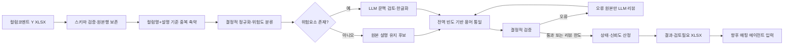

# 컬럼설명 기반 한글속성명 생성 에이전트 구현 계획 및 HANDOFF

## 1. 문서 목적

이 문서는 `meta_ai_kor_comment`에 새로 구현할 컬럼설명 기반 한글속성명 생성
에이전트의 확정 요구사항, 처리 설계, 품질 평가 체계, stage commit별 개발 순서와
완료 기준을 다음 구현 담당자에게 전달한다.

현재 `meta_ai_mapping`은 변경하지 않는다. 이 에이전트가 생성한
`컬럼명 + 한글속성명` 결과가 이후 매핑 에이전트의 입력이 된다.

문서 기준일은 2026-08-03이다.

## 2. 확정된 요구사항

- 입력: `data/table_column_template_컬럼코멘트Y.xlsx`
- 프로젝트 경로: `meta_ai_kor_comment`
- 한글속성명 생성 기준: 컬럼설명을 주 근거로 사용한다.
- 이미 속성명 형태인 깨끗한 컬럼설명은 그대로 사용한다.
- 한글속성명에는 영문 `ID`만 허용한다.
  - `FY년도`는 `회계년도`처럼 한글화한다.
  - `SMS`, `NEW`, `RH`, `TPMS` 등도 최종 한글속성명에 그대로 남기지 않는다.
- 숫자는 업무 의미를 가지므로 원래 위치와 의미를 보존한다.
- 특수문자와 기호는 허용하지 않는다.
  - `/`가 있는 설명은 기호를 제거하고 테이블·컬럼 문맥에 맞는 의미 하나를 선택한다.
  - 두 대안을 기계적으로 `또는`으로 연결하지 않는다.
- 동의어·유사 표현은 전체 입력에서 출현 빈도가 높은 표현으로 통일한다.
  - 빈도가 같으면 테이블·컬럼 문맥에 더 자연스러운 표현을 선택한다.
- 원본 12개 컬럼 뒤에 다음 컬럼을 추가한다.
  - `한글속성명`
  - `처리상태`
  - `신뢰도`
  - `처리방식`
  - `변환근거`
  - `검토사유`
- `검토필요`와 `검증실패` 결과는 별도 `검토필요` 시트에 복제한다.
- 운영 형태는 `meta_ai_mapping`과 같은 FastAPI 서비스로 한다.
  - 단일 요청
  - 비동기 작업
  - 상태 조회
  - 진행률 스트리밍과 heartbeat
- 기존 로컬 LLM 엔드포인트와 모델 설정을 재사용한다.
- 결과 생성은 사람 승인을 기다리지 않고 완료한다.
- 개발 stage의 완료 여부는 독립 AI 리뷰와 블라인드 사람 리뷰 점수로 판정한다.
- AI와 사람 리뷰는 각각 별도 Codex 스킬로 구현한다.
- 모든 stage candidate commit에서 두 리뷰 스킬을 실행한다.
- 점수나 필수 게이트가 목표에 미달하면 개선 commit을 만들고 두 리뷰를 다시 수행한다.

## 3. 입력 데이터 기준선

`table_column_template_컬럼코멘트Y.xlsx`의 2026-08-03 분석 결과는 다음과 같다.

| 항목 | 값 | 설계 영향 |
|---|---:|---|
| 전체 데이터 행 | 1,195 | 결과도 정확히 1,195행이어야 한다. |
| 컬럼설명 존재 행 | 1,195 | 빈 설명 복구보다 의미 보존이 중심이다. |
| 고유 컬럼명 | 918 | 컬럼명만으로 중복 축약하면 안 된다. |
| 고유 컬럼설명 | 921 | 대부분 이미 정제된 속성명 형태이다. |
| 고유 컬럼명·설명 조합 | 921 | 기본 생성 모집단으로 사용한다. |
| 중복 축약 가능 행 | 274 | 동일 컬럼명·설명은 한 번 처리 후 복제한다. |
| 동일 컬럼명의 복수 설명 | 3종 | 전역 강제 통일 전에 문맥 확인이 필요하다. |
| 공백·밑줄·괄호 포함 설명 | 0 | 단순 공백 제거가 핵심 작업은 아니다. |
| 영문 포함 설명 | 51 | `ID` 외 전부 한글화해야 한다. |
| 숫자 포함 설명 | 45 | 숫자 유실 여부를 별도 검증해야 한다. |
| `/` 포함 설명 | 4 | 문맥 기반 단일 의미 선택이 필요하다. |
| 설명 길이 중앙값 | 6자 | 보수적 유지 전략이 적합하다. |
| 설명 길이 90백분위 | 10자 | 긴 복합 설명만 우선 검토한다. |
| 설명 최대 길이 | 15자 | 임의 길이 절단을 두지 않는다. |

동일 컬럼명에 설명이 다른 확인 대상은 다음과 같다.

- `USDCR_RT`: `중고차요율`, `중고차율`
- `CR_TYCD`: `차량형태코드`, `차형태코드`
- `PYM_CT`: `납부횟수`, `납입횟수`

주요 접미어 빈도는 `코드` 367건, `여부` 139건, `번호` 88건,
`일자` 88건, `회차` 77건, `일시` 58건이다. 이 빈도는 접미어 정책과
동의어 통일의 초기 기준으로 사용한다.

## 4. 목표와 비목표

### 목표

- 원본 1,195행 모두에 한글속성명을 생성한다.
- 깨끗한 설명은 불필요하게 변경하지 않는다.
- `ID`를 제외한 영문 표현을 문맥에 맞는 한글로 변환한다.
- 의미 있는 숫자를 보존한다.
- 특수문자와 기호를 제거하고 `/` 표현은 문맥에 맞는 의미 하나로 결정한다.
- 동의어는 데이터 전체 빈도와 문맥을 사용해 일관되게 통일한다.
- 모든 변경의 원본, 처리방식, 근거, 신뢰도와 검토 사유를 추적 가능하게 한다.
- 구조·문자 정책은 결정적 코드로 전수 검증한다.
- 의미·자연스러움은 생성 모델과 분리된 AI 리뷰 및 사람 리뷰로 검증한다.
- 매 stage commit의 점수와 이슈를 재현 가능한 파일로 보존한다.

### 비목표

- `meta_ai_mapping` 수정
- 매핑 결과를 이용한 한글속성명 생성
- 영문 Full Name 생성
- 입력 원본 12개 컬럼 수정
- 사람 승인을 기다린 뒤에만 결과를 생성하는 런타임 워크플로
- 생성 과정에서 발견한 용어를 외부 표준사전에 자동 반영하는 기능
- 최종 업무 표준용어 관리 UI

## 5. 처리 아키텍처



### 처리 원칙

1. 입력 설명을 정답 후보로 보고 보수적으로 처리한다.
2. 규칙으로 확정할 수 있는 행은 LLM이 자유 재작성하지 못하게 한다.
3. LLM에는 컬럼명, 컬럼설명, 테이블명, 테이블설명, 데이터타입과 구체적인
   위험 코드를 제공한다.
4. LLM이 변경한 경우 추가·삭제·치환한 의미를 구조화해 반환하게 한다.
5. 동일 입력은 동일 결과를 내도록 정렬과 동률 해소를 결정적으로 구현한다.
6. 전역 용어 통일에서 실제 빈도 계산은 코드가 수행하고 LLM은 동의어 그룹과
   동률 문맥 판단만 담당한다.
7. 생성 통과 행은 리뷰 라운드에서 다시 생성하지 않는다.
8. 리뷰 한도 뒤에도 오류가 남으면 결과를 폐기하지 않고 `검증실패`로 출력한다.

## 6. 입력과 중복 처리

### 입력 시트

- 기본 시트명: `테이블_컬럼_정보`
- 헤더의 공백과 끝의 `(*)`는 읽을 때만 정규화한다.
- 필수 컬럼: `컬럼명`, `컬럼설명`
- 보조 문맥: `스키마`, `테이블명`, `테이블설명`, `컬럼순번`, `데이터타입`
- 원본 Excel 행 번호와 행 내용을 이용해 안정적인 `source_id`를 생성한다.

### 중복 축약 키

```text
(대문자 정규화 컬럼명, 문자 정규화 컬럼설명)
```

같은 키만 한 번 처리한 뒤 모든 원본행에 복제한다. 동일 컬럼명이라도 설명이
다르면 독립적으로 처리한다. 테이블 문맥이 결과를 바꿀 가능성이 감지된 경우에는
대표 결과를 복제하지 않고 해당 문맥 행을 별도로 재검토한다.

## 7. 한글속성명 생성 규칙

### 7.1 원본 유지

다음 조건을 모두 만족하면 기본 후보는 컬럼설명을 그대로 사용한다.

- 비어 있지 않다.
- 공백, 밑줄, 특수문자, 기호가 없다.
- `ID` 외 영문이 없다.
- 숫자가 원본과 동일한 순서로 보존된다.
- 동일 컬럼명 또는 유사 문맥의 용어 빈도 정책과 충돌하지 않는다.
- 테이블·컬럼 문맥과 명백히 모순되지 않는다.

원본 유지도 검증과 품질 리뷰 대상에서 제외하지 않는다.

### 7.2 영문 한글화

- 최종 결과에 허용되는 영문은 대문자 `ID`뿐이다.
- 영문 토큰은 문맥에 맞는 완전한 한글 표현으로 치환한다.
- 예: `FY년도 → 회계년도`.
- `SMS`, `NEW`, `RH`, `TPMS` 등은 원문 약어를 그대로 남기지 않는다.
- 영문 토큰의 의미가 문맥으로 확정되지 않으면 임의 번역하지 않고 `검토필요`로
  표시한다.
- 영문이 제거되었는지는 코드로 전수 검사한다.

### 7.3 숫자 보존

- 원본 설명에 존재하는 모든 숫자 시퀀스를 결과에 보존한다.
- 숫자의 순서와 업무 의미를 바꾸지 않는다.
- `518`, `제2`, `23조`처럼 숫자가 업무 개념의 일부이면 삭제하거나 한글 수사로
  임의 변환하지 않는다.
- 보험기간 순번처럼 회차를 뜻하는 `제N`은 승인된 문맥에서 `N회차`로 명확히
  표현한다. 실제 데이터의 `제2보험기간적용보험료`는
  `2회차보험기간적용보험료`를 표준으로 사용한다.
- `제23조`, `제1호`, `제2종`, `제3급`, `제2판`처럼 회차가 아닌 서수에는
  `N회차` 규칙을 적용하지 않는다.
- 숫자가 새로 추가되거나 누락되면 결정적 오류로 처리한다.

### 7.4 특수문자와 `/` 처리

- 최종 결과에는 `/`, `_`, `-`, 괄호, 점, 쉼표 등 특수문자와 기호를 허용하지 않는다.
- `/`의 양쪽 후보를 단순 결합하거나 `또는`으로 기계 변환하지 않는다.
- 컬럼명 토큰, 테이블명·설명, 데이터타입과 주변 컬럼 문맥을 사용해 실제 의미
  하나를 선택한다.
- 선택하지 않은 대안과 선택 근거를 `변환근거`와 `검토사유`에 기록한다.
- 다음 4건은 benchmark의 필수 고위험 사례로 고정한다.
  - `CHSNO_OR_TMPNO / 차대번호/임시번호`
  - `ACT_OR_ACTCT / 구좌/계좌수`
  - `APO_OR_STBDT / 위촉/개설일자`
  - `APO_OR_STB_MMTHR / 위촉/개설차월`

### 7.5 빈도 기반 용어 통일

1. 초기 결과를 의미 컴포넌트로 분해한다.
2. LLM은 동의어 가능 그룹만 제안하고 실제 출현 건수는 코드가 계산한다.
3. 그룹 안에서 출현 빈도가 가장 높은 표면형을 표준 후보로 선택한다.
4. 동률이면 테이블·컬럼 문맥에 더 자연스러운 표현을 행별로 선택한다.
5. 문맥상 실제 의미가 다른 단어는 형태가 비슷해도 같은 그룹으로 합치지 않는다.
6. 선택된 표준어, 후보별 빈도, 동률 여부와 판단 근거를 실행 메타데이터에 남긴다.

초기 검증 사례는 `납입/납부`, `율/요율`, `차/차량`이다. 단순 문자열 치환표로
고정하지 않고 전체 코퍼스 빈도와 문맥을 함께 사용한다.

## 8. LLM 구조화 응답

생성 모델은 다음 의미의 JSON만 반환한다.

```json
{
  "results": [
    {
      "source_id": "row-2",
      "original_description": "FY년도",
      "korean_attribute_name": "회계년도",
      "action": "rewrite",
      "confidence": 94,
      "reason": "FY를 회계로 한글화하고 숫자·기호 변경은 없음",
      "semantic_units": ["회계", "년도"],
      "added_concepts": [],
      "removed_concepts": [],
      "review_reasons": []
    }
  ]
}
```

`action`은 `keep`, `normalize`, `rewrite`만 허용한다. 모델이 원본 의미를 추가하거나
삭제했다고 보고한 행은 자동확정하지 않는다. 응답 파싱, source ID, 신뢰도 범위,
허용 action과 필수 필드는 Pydantic 모델로 검증한다.

## 9. 결정적 검증과 자동 리뷰

### 결정적 검증

- 입력 1,195행과 출력 1,195행의 `source_id` 1:1 대응
- 원본 12개 컬럼의 값과 행 순서 보존
- 한글속성명 비어 있음 금지
- 공백, 밑줄, 특수문자와 기호 금지
- `ID` 외 `[A-Za-z]` 금지
- 원본과 결과의 숫자 시퀀스·순서 일치
- 동일 입력 키의 결과 일치
- 처리상태, 신뢰도, 처리방식, 근거와 검토사유의 계약 일치
- 신뢰도 0~100 정수
- `keep` 결과가 원본 설명과 정확히 일치
- `normalize`와 `rewrite` 결과의 변경 근거 존재
- 용어 통일 결과가 계산된 빈도 결정과 일치

### 런타임 LLM 리뷰

- 결정적 오류 또는 낮은 신뢰도 원본만 최대 2회 재검토한다.
- 리뷰 입력에는 현재 결과, 오류 코드, 실제값, 기대 조건과 용어 빈도 표를 제공한다.
- 통과 행은 리뷰에서 변경하지 않는다.
- 리뷰 후 전역 용어 통일과 결정적 검증을 다시 수행한다.
- 최대 횟수 이후 결정적 오류 또는 LLM 호출·응답 실행 실패가 남으면
  `검증실패`로 출력한다. 이미 결정적으로 유효한 현재 결과를 보호하기 위해
  대체 리뷰 후보가 정책 검증에서 거부된 경우에는 현재 결과를 유지하고
  `검토필요`로 출력하며, 실행 실패와 분리해 메타데이터에 기록한다.

## 10. 상태와 신뢰도

### 상태

| 상태 | 조건 |
|---|---|
| `자동확정` | 결정적 검증 통과, 의미 추가·삭제 없음, 모호성 없음, 신뢰도 임계값 이상 |
| `검토필요` | 결과는 존재하고 형식 검증은 통과했지만 문맥 선택·동의어 동률·낮은 신뢰도가 있음 |
| `검증실패` | 리뷰 한도 뒤에도 결정적 오류 또는 중대한 의미 불확실성이 남음 |

권장 초기 자동확정 임계값은 90이다. benchmark 결과를 보고 설정값으로 조정한다.

### 신뢰도 신호

- 원본 유지 여부
- 규칙 정규화만 사용했는지
- LLM 재작성 여부
- 영문 변환의 문맥 명확성
- 숫자 보존 여부
- `/` 대안 선택 여부
- 동의어 빈도 우위 또는 동률 여부
- 동일 문맥 일관성
- 생성과 리뷰 결과의 일치 여부
- 결정적 검증 통과 여부

## 11. 결과 XLSX 계약

### `한글속성명_결과` 시트

원본 12개 컬럼의 값, 순서와 가능한 서식을 보존하고 뒤에 다음 6개 컬럼을 추가한다.

| 추가 컬럼 | 내용 |
|---|---|
| `한글속성명` | 공백과 기호가 없고 `ID` 외 영문이 없는 최종 이름 |
| `처리상태` | `자동확정`, `검토필요`, `검증실패` |
| `신뢰도` | 0~100 정수 |
| `처리방식` | `유지`, `정규화`, `재작성` |
| `변환근거` | 원본 대비 변경과 빈도·문맥 판단 근거 |
| `검토사유` | 자동확정이 아닌 구체적 이유 또는 빈 값 |

### `검토필요` 시트

`검토필요`와 `검증실패`인 행을 복제하고 다음을 포함한다.

- 원본행/source ID
- 테이블명·테이블설명
- 컬럼명·컬럼설명
- 한글속성명
- 처리상태·신뢰도·처리방식
- 변환근거·검토사유
- 추천 확인 포인트

## 12. API 계획

### 엔드포인트

- `GET /health`
- `POST /v1/comment-korean-column-names`
- `POST /v1/comment-korean-column-names/jobs`
- `GET /v1/comment-korean-column-names/jobs/{job_id}`
- `GET /v1/comment-korean-column-names/jobs/{job_id}/progress`

### 주요 옵션

- `batch_size`: 기본 25
- `max_concurrency`: 기본 10
- `max_review_rounds`: 기본 2
- `auto_confirm_threshold`: 기본 90

LLM 연결, 읽기, 쓰기, pool timeout과 재시도 설정은 `meta_ai_mapping`과 같은
환경변수 구조를 사용한다. 진행 단계는 `queued`, `input`, `normalize`, `generate`,
`reconcile`, `validate`, `review`, `output`, `failed`로 기록한다.

## 13. 리뷰 체계 역설계

생성 중의 LLM 리뷰와 stage commit 품질을 평가하는 리뷰 스킬은 별개다.

- 런타임 리뷰: 현재 작업의 오류 행을 수정한다.
- AI 품질 리뷰 스킬: 결과 전체를 독립적으로 전수 검사하고 점수를 계산한다.
- 사람 품질 리뷰 스킬: 고정된 위험도 층화 표본을 블라인드 평가한다.

기존 `meta_ai_kor/skills/score-korean-columns-*`의 블라인드 표본, 고정 seed,
가중치 점수와 score cap 구조는 참고한다. 약어 분해, Full Name, 매핑 근거 차원은
이번 목적과 맞지 않으므로 재사용하지 않는다.

### 13.1 AI 리뷰가 담당할 판단

AI 리뷰는 다음에 강하다.

- 1,195행 전체의 구조·형식·문자 정책 전수 검사
- 921개 고유 컬럼명·설명 조합의 의미 보존 비교
- 영문 한글화와 숫자 보존 검토
- `/` 대안 선택의 테이블·컬럼 문맥 적합성 검토
- 동의어 그룹의 실제 빈도 결정과 최종 결과 대조
- 동일 입력 및 유사 문맥의 용어 일관성 검토
- 처리상태·신뢰도·변환근거가 실제 위험과 맞는지 검토

AI 리뷰에는 생성 시스템 프롬프트, 생성 모델의 내부 추론, 이전 AI 점수와 사람
점수를 제공하지 않는다. 같은 모델 엔드포인트를 사용해도 평가 입력을 분리하며,
별도 모델을 사용할 수 있으면 설정으로 교체 가능하게 한다.

### 13.2 AI 리뷰 루브릭 초안

| 차원 | 배점 | 핵심 근거 |
|---|---:|---|
| 원본·출력 구조 무결성 | 10 | 행·순서·원본 12개 컬럼·필수 결과 컬럼 전수 비교 |
| 문자·형식 정책 준수 | 15 | ID 외 영문, 숫자 누락, 공백·기호 전수 검사 |
| 컬럼설명 의미 충실도 | 25 | 핵심 의미의 누락·추가·반전 여부 |
| 문맥 선택·모호성 해소 | 15 | `/`, 영문 약어, 복수 설명의 문맥상 선택 |
| 빈도 기반 용어 일관성 | 15 | 동의어 그룹의 실제 빈도와 동률 처리 |
| 한글속성명 자연스러움 | 10 | 어순, 간결성, 표준 접미어, 읽기 자연스러움 |
| 상태·근거·신뢰도 정합성 | 10 | 위험한 결과를 자동확정하지 않았는지와 근거 추적성 |

AI 평점은 차원별 0~5이며 가중치로 100점으로 환산한다.

필수 체크는 다음으로 한다.

- `row_preservation`
- `required_columns_complete`
- `character_policy_complete`
- `numeric_preservation_complete`
- `semantic_scope_complete`
- `terminology_frequency_verified`
- `evidence_traceable`
- `score_scope_complete`

최종 통과 기준:

- AI 점수 92점 이상
- 모든 차원 평점 4.0 이상
- critical 이슈 0건
- 결정적 검증 실패 0건
- 필수 체크 전부 true

critical은 원본행 누락·변조, 빈 결과, 핵심 의미 반전, 근거 없는 업무 개념 추가,
숫자로 표현된 핵심 범위 유실처럼 실제 데이터 오해를 만드는 오류다.

### 13.3 사람 리뷰가 담당할 판단

사람 리뷰는 다음에 강하다.

- 실제 보험·계약·고객 업무 의미가 맞는지 판단
- 원문 의미를 보존하면서 속성명으로 자연스러운지 판단
- `/`에서 선택한 한쪽 의미가 실제 컬럼을 대표하는지 판단
- 빈도 우선 표준어가 해당 문맥에서도 자연스러운지 판단
- 이름만 보았을 때 다른 데이터로 오해할 가능성 판단

사람 리뷰어는 AI 점수·AI 이슈, 생성 신뢰도·처리상태, 생성 모델의 근거와 이전
stage 점수를 보지 않는다. 다음 정보만 본다.

- source ID
- 테이블명·테이블설명
- 컬럼명·컬럼설명
- 생성된 한글속성명

### 13.4 사람 리뷰 루브릭 초안

| 차원 | 배점 | 핵심 질문 |
|---|---:|---|
| 업무 의미 정확성 | 30 | 실제 컬럼이 뜻하는 업무 개념인가? |
| 원문 의미 완전성 | 20 | 설명의 핵심 범위·수식어·숫자를 빠짐없이 담았는가? |
| 문자·표기 정책 준수 | 10 | ID 외 영문과 기호가 없고 숫자가 보존됐는가? |
| 문맥 선택·오해 안전성 | 15 | 선택한 의미가 문맥에 맞고 다른 뜻으로 오해되지 않는가? |
| 용어 일관성 | 15 | 같은 의미에 빈도 우선 표준어를 일관되게 썼는가? |
| 자연스러움·간결성 | 10 | 공백 없는 속성명으로 자연스럽고 불필요하게 길지 않은가? |

사람 평점은 차원별 1~5로 한다.

- 1: 사용할 수 없음
- 2: 중대한 수정 필요
- 3: 의미는 전달되나 개선 필요
- 4: 대체로 적절함
- 5: 그대로 표준명으로 사용 가능

심각도는 `pass`, `minor`, `major`, `critical`을 사용한다. `major`와 `critical`은
구체적인 수정 의견을 필수로 입력한다.

최종 통과 기준:

- 사람 점수 88점 이상
- 모든 차원 평균 3.8 이상
- critical 0건
- major 오류율 2% 이하
- 최소 표본과 필수 위험군 충족

### 13.5 사람 리뷰 표본

stage ID를 고정 seed로 사용한다. 같은 stage의 개선 commit은 같은 source ID 표본을
유지해 표본 변경으로 점수를 유리하게 만드는 것을 막는다. 각 candidate commit에서는
동일 표본의 변경된 결과를 사람이 새로 평가한다.

권장 최소 표본은 80행이며 다음 위험군을 포함한다.

| 위험군 | 목표 수 |
|---|---:|
| 원본 유지·저위험 | 15 |
| ID 외 영문 한글화 | 15 |
| 숫자 보존 | 10 |
| `/` 문맥 선택 | 전체 4건 |
| 동의어·빈도 통일 | 10 |
| 동일 컬럼명 복수 설명·중복 문맥 | 10 |
| LLM 재작성 | 10 |
| 검토필요·낮은 신뢰도 | 10 |

한 행이 여러 위험군에 해당할 수 있다. 표본 스크립트는 필수 위험군을 먼저 채우고
부족분을 stage seed 기반 무작위 표본으로 채운다.

## 14. 리뷰 스킬 구현 계획

스킬은 `skill-creator` 절차에 따라 초기화하고 각 폴더에 `SKILL.md`,
`agents/openai.yaml`, 필요한 `scripts/`와 `references/`만 둔다. 불필요한 README나
보조 문서는 만들지 않는다.

### 14.1 AI 리뷰 스킬

이름: `score-comment-korean-columns-ai`

```text
skills/score-comment-korean-columns-ai/
├── SKILL.md
├── agents/
│   └── openai.yaml
├── references/
│   ├── rubric.json
│   └── naming-policy.md
└── scripts/
    ├── build_review_population.py
    ├── check_integrity.py
    └── score_review.py
```

역할:

1. 원본·결과 구조를 전수 비교한다.
2. 문자·숫자·기호 정책을 결정적으로 검사한다.
3. 921개 고유 조합을 독립 AI가 의미 검토한다.
4. 빈도 기반 용어 결정을 재계산해 결과와 대조한다.
5. 차원별 관찰과 근거 있는 이슈를 `ai-observations.json`으로 저장한다.
6. 스크립트가 루브릭 버전과 score cap을 적용해 `ai-score.json`을 만든다.

### 14.2 사람 리뷰 스킬

이름: `score-comment-korean-columns-human`

```text
skills/score-comment-korean-columns-human/
├── SKILL.md
├── agents/
│   └── openai.yaml
├── references/
│   └── rubric.json
└── scripts/
    ├── select_sample.py
    ├── ratings_csv_to_json.py
    └── score_review.py
```

역할:

1. stage ID 고정 seed로 위험도 층화 표본을 생성한다.
2. AI·생성 정보를 숨긴 `human-sample.csv`를 만든다.
3. 사람 리뷰어가 평점·심각도·의견을 입력한다.
4. 입력을 검증하고 `human-ratings.json`으로 변환한다.
5. 루브릭 가중치와 오류율 cap을 적용해 `human-score.json`을 만든다.

사람 리뷰는 자동화하거나 AI가 대신 작성하지 않는다. 스킬은 표본 준비, 입력 검증,
공식 점수 계산과 개선 항목 정리를 담당한다.

### 14.3 스킬 검증

- `quick_validate.py`로 스킬 구조와 frontmatter를 검증한다.
- 점수 스크립트에 경계값, 누락 차원, 잘못된 심각도와 score cap 테스트를 작성한다.
- 샘플 선택이 같은 stage ID에서 재현되는지 테스트한다.
- 다른 stage ID에서는 표본이 달라지는지 테스트한다.
- forward test에는 원본·결과 artifact만 제공하고 예상 점수나 알려진 결함을 노출하지 않는다.

## 15. Stage commit과 품질 개선 루프

### 공통 실행 절차

1. stage 기능을 구현하고 candidate commit을 만든다.
2. 고정 benchmark로 결과 XLSX, 실행 메타데이터와 리뷰 모집단을 생성한다.
3. AI 리뷰 스킬로 전수 검토하고 `ai-score.json`을 만든다.
4. 사람 리뷰 스킬로 stage 고정 표본을 만들고 사람이 블라인드 평가한다.
5. `human-score.json`을 만든다.
6. 결과를 `quality/reviews/<stage-id>/<commit-sha>/`에 저장한다.
7. 목표 미달이면 critical → major → 점수 영향도가 큰 minor 순으로 개선한다.
8. 새 candidate commit을 만들고 두 리뷰 스킬을 다시 실행한다.
9. 두 점수와 모든 필수 게이트를 만족한 commit만 stage 완료로 표시한다.

이전 리뷰 점수나 의견을 새 AI 평가 입력으로 사용하지 않는다. 사람은 같은 표본을
다시 보되 이전 점수를 복사하지 않고 변경 결과를 새로 평가한다.

### 리뷰 산출물

```text
quality/reviews/<stage-id>/<commit-sha>/
├── result.xlsx
├── run-metadata.json
├── review-population.jsonl
├── deterministic-checks.json
├── ai-observations.json
├── ai-score.json
├── human-sample.csv
├── human-ratings.json
├── human-score.json
└── improvement-backlog.md
```

`improvement-backlog.md`에는 영향 source ID, 심각도, 원인, 수정 위치, 기대 개선,
회귀 테스트를 기록한다.

## 16. 개발 Stage와 점수 게이트

| Stage | 구현 범위 | AI 목표 | 사람 목표 | 필수 게이트 |
|---|---|---:|---:|---|
| S0 | 계약, baseline, 두 리뷰 스킬 | 기준선 기록 | 기준선 기록 | 점수 재현, 표본 고정 |
| S1 | 프로젝트 골격, XLSX I/O, 원본 보존 | 75 | 70 | 행·원본 보존 100% |
| S2 | 정규화, ID·숫자·기호 정책, 위험 분류 | 84 | 78 | 형식 오류 0건 |
| S3 | LLM 보수 생성, 영문 한글화, `/` 선택 | 89 | 84 | 빈 결과·critical 0건 |
| S4 | 빈도 기반 용어 통일, 전역 일관성 | 92 | 88 | major 오류율 2% 이하 |
| S5 | 검증, 오류행 리뷰, 신뢰도·상태 | 92 | 88 | 결정적 오류 0건 |
| S6 | API, 비동기 작업, 진행률, XLSX | 92 | 88 | 이전 점수 회귀 없음 |
| S7 | 성능, 복구, 문서, 최종 안정화 | 94 | 90 | 전체 완료 기준 충족 |

S4부터 최종 최소 기준인 AI 92점, 사람 88점을 낮출 수 없다. 최종 목표를 넘더라도
critical 이슈나 필수 체크 실패가 있으면 통과시키지 않는다.

## 17. 프로젝트 구조 계획

```text
meta_ai_kor_comment/
├── app/
│   ├── config.py
│   ├── excel.py
│   ├── exceptions.py
│   ├── jobs.py
│   ├── llm.py
│   ├── main.py
│   ├── models.py
│   ├── normalization.py
│   ├── prompts.py
│   ├── terminology.py
│   ├── validation.py
│   └── workflow.py
├── quality/
│   ├── benchmark/
│   └── reviews/
├── scripts/
│   ├── build_baseline.py
│   ├── build_review_population.py
│   └── smoke_llm.py
├── skills/
│   ├── score-comment-korean-columns-ai/
│   └── score-comment-korean-columns-human/
├── tests/
├── .env.example
├── .gitignore
├── pyproject.toml
├── README.md
└── HANDOFF.md
```

## 18. 테스트 전략

### 단위 테스트

- 깨끗한 설명 그대로 유지
- `FY년도 → 회계년도`
- ID 보존과 ID 외 영문 차단
- `SMS`, `NEW`, `RH`, `TPMS` 한글화
- `518`, `제2`, `23조` 숫자 보존
- `/` 기호 제거 및 문맥 선택
- 특수문자 전수 거부
- 동의어 빈도 우선과 동률 문맥 처리
- 신뢰도 경계값과 상태 산정

### 속성 기반 테스트

- 입력 숫자 시퀀스와 출력 숫자 시퀀스가 항상 동일하다.
- `ID`를 제거한 결과에는 ASCII 영문자가 없다.
- 결과에는 허용되지 않은 기호가 없다.
- 같은 중복 키는 항상 같은 결과를 갖는다.
- 원본행 수와 순서가 항상 보존된다.

### 통합 테스트

- Fake LLM으로 입력 → 생성 → 빈도 통일 → 검증 → 리뷰 → XLSX 전체 루프
- 리뷰 실패가 남아도 결과와 검토필요 시트가 생성되는지
- 동일 컬럼명의 복수 설명이 독립적으로 유지되는지
- 비동기 작업 결과와 진행률·시간 메타데이터가 일치하는지

### 리뷰 스킬 테스트

- 루브릭 가중치 합계가 100인지
- critical과 필수 체크 실패 시 점수 cap이 적용되는지
- 사람 major 오류율 2% 초과 시 실패하는지
- 필수 위험군이 사람 표본에 모두 포함되는지
- stage seed와 표본이 재현되는지

## 19. 실패 복구와 운영 고려사항

- LLM timeout, 잘못된 JSON, 일부 배치 실패를 원본별로 기록한다.
- 한 배치 실패가 전체 작업을 폐기하지 않게 한다.
- 생성 호출이 실패해도 결정적 복구 결과가 유효하면 결과를 폐기하지 않고
  `검토필요`로 남기며 생성 fallback 통계에 기록한다. 이후 요청된 리뷰의
  호출·응답 실행이 재시도 뒤에도 실패한 원본은 `검증실패`로 부분 결과에
  포함한다. 결정적으로 유효한 현재 결과를 보호한 생성·리뷰 후보 거부는 실행
  실패로 집계하지 않고 `검토필요`와 별도 거부 통계로 추적한다.
- 결과 파일은 임시 경로에 완성한 뒤 원자적으로 최종 경로로 교체한다.
- 진행률 heartbeat로 긴 LLM 호출 중 연결 유지를 보장한다.
- 실행 메타데이터에는 모델, 주요 설정, 입력 파일 해시, 용어 빈도 결정과 리뷰 횟수를 남긴다.
- 로그에 입력 전체 내용이나 민감한 테이블 데이터를 불필요하게 출력하지 않는다.

## 20. 완료 정의

- 입력 1,195행 모두에 한글속성명이 존재한다.
- 원본 12개 컬럼의 값, 행 순서와 기본 서식이 보존된다.
- 한글속성명에는 공백·특수문자·기호가 없다.
- 영문은 `ID`만 존재한다.
- 모든 원본 숫자 시퀀스가 결과에 보존된다.
- `/` 4건이 문맥에 맞는 단일 의미로 처리되고 근거가 기록된다.
- 동의어는 빈도 우선, 동률 문맥 우선 규칙에 따라 재현 가능하게 통일된다.
- 결정적 검증 오류가 0건이다.
- 검토필요 건수와 비율이 결과와 작업 메타데이터에 기록된다.
- 단일·비동기 API, 상태 조회와 진행률 스트리밍이 동작한다.
- 외부 LLM을 호출하지 않는 자동 테스트가 모두 통과한다.
- 실제 로컬 LLM smoke test가 통과한다.
- AI 리뷰 스킬과 사람 리뷰 스킬이 구조 검증과 forward test를 통과한다.
- 최종 AI 점수 92점 이상, 사람 점수 88점 이상이다.
- critical 오류 0건, 사람 major 오류율 2% 이하이다.
- 같은 입력·설정·stage ID에서 결정적 검사, 점수와 사람 표본이 재현된다.

## 21. 구현 착수 순서

1. S0에서 입력·출력 계약과 baseline을 고정한다.
2. 실제 기능 개발 전에 두 리뷰 루브릭과 점수 계산 스크립트를 먼저 만든다.
3. 두 스킬을 초기화·검증하고 baseline 점수를 기록한다.
4. S1부터 stage candidate commit 단위로 기능을 구현한다.
5. 각 candidate commit에서 AI와 사람 리뷰를 모두 수행한다.
6. 점수 미달 이슈를 `improvement-backlog.md`로 만들고 개선 commit을 반복한다.
7. S7 최종 게이트를 만족한 결과만 매핑 에이전트 입력 후보로 승인한다.
