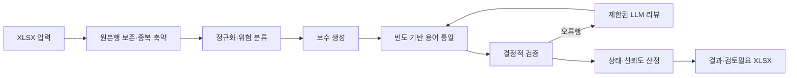

# 컬럼설명 기반 한글속성명 생성 API

`data/table_column_template_컬럼코멘트Y.xlsx`의 컬럼설명을 주 근거로 공백 없는
한글속성명을 생성하는 FastAPI 서비스입니다. 깨끗한 설명은 유지하고, `ID` 외 영문은
한글화하며, 숫자는 원래 순서대로 보존합니다. 특수기호를 제거하고 `/` 표현은
테이블·컬럼 문맥에 맞는 의미 하나로 선택합니다.

## 처리 흐름



출력의 `한글속성명_결과` 시트는 원본 12개 열과 행 순서·기본 서식을 유지하고
`한글속성명`, `처리상태`, `신뢰도`, `처리방식`, `변환근거`, `검토사유`를 뒤에
추가합니다. `검토필요`와 `검증실패` 행은 별도 `검토필요` 시트에도 복제합니다.
결과 파일은 임시 파일에 완성한 뒤 최종 경로로 원자적으로 교체합니다.

## 실행

Python 3.11 이상이 필요합니다.

```bash
python -m venv .venv
pip install -e ".[dev]"
uvicorn app.main:app --host 0.0.0.0 --port 8003
```

로컬 LLM 엔드포인트와 timeout은 `.env.example`의 환경변수로 설정합니다. 기본 읽기
timeout은 30분이며 비동기 진행률 스트림은 기본 15초마다 heartbeat를 보냅니다.

## API

- `GET /health`
- `POST /v1/comment-korean-column-names`
- `POST /v1/comment-korean-column-names/jobs`
- `GET /v1/comment-korean-column-names/jobs/{job_id}`
- `GET /v1/comment-korean-column-names/jobs/{job_id}/progress`

단일 요청:

```bash
curl -X POST "http://localhost:8003/v1/comment-korean-column-names" \
  -F "file=@../data/table_column_template_컬럼코멘트Y.xlsx" \
  -F "batch_size=25" \
  -F "max_concurrency=10" \
  -F "max_review_rounds=2" \
  -F "auto_confirm_threshold=90" \
  -o 한글속성명.xlsx
```

긴 작업에는 비동기 API를 사용합니다.

```bash
curl -X POST "http://localhost:8003/v1/comment-korean-column-names/jobs" \
  -F "file=@../data/table_column_template_컬럼코멘트Y.xlsx"

curl -N "http://localhost:8003/v1/comment-korean-column-names/jobs/{job_id}/progress"
```

완료 파일은 기본적으로 `results/{job_id}.xlsx`에 저장됩니다. 상태 응답에는 행 수,
자동확정·검토필요·검증실패 건수, 리뷰 횟수, 결정적 검증 통계, 단계별 소요시간이
포함됩니다.

## 테스트와 품질 리뷰

자동 테스트는 외부 LLM을 호출하지 않으며 실제 입력 워크북을 기반으로 원본 1,195행
보존, 결과 열·검토 시트, API와 작업 진행률 계약을 검증합니다.

```bash
pytest
```

stage 품질 평가는 `skills/score-comment-korean-columns-ai`와
`skills/score-comment-korean-columns-human`을 각각 실행합니다. AI 평가는 전수 구조·정책과
의미 충실도를 검토하고, 사람 평가는 고정 위험도 표본을 블라인드로 평가합니다.
사람 평점은 실제 이해관계자가 입력해야 하며 AI가 대신 작성하지 않습니다.
