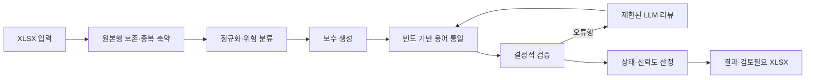

# 컬럼설명 기반 한글속성명 생성 API

컬럼설명이 존재하는 임의 도메인의 XLSX를 입력받아 공백 없는 한글속성명을 생성하는
FastAPI 서비스입니다. 깨끗한 설명은 유지하고, `ID` 외 영문은 한글화하며, 숫자는
원래 순서와 의미대로 보존합니다. 특수기호를 제거하고 `/` 표현은 테이블·컬럼
문맥에 맞는 의미 하나로 선택합니다. 도메인 특화 지식(영문 약어 사전, 동의어
그룹)은 코드가 아닌 YAML 규칙 파일로 주입하며, 규칙이 없으면 도메인 무관 순수
LLM 경로로 동작합니다.

## 처리 흐름



출력의 `한글속성명_결과` 시트는 원본 12개 열과 행 순서·기본 서식을 유지하고
`한글속성명`, `처리상태`, `신뢰도`, `처리방식`, `변환근거`, `검토사유`를 뒤에
추가합니다. `검토필요`와 `검증실패` 행은 별도 `검토필요` 시트에도 복제합니다.
결과 파일은 임시 파일에 완성한 뒤 최종 경로로 원자적으로 교체합니다.

## 실행

Python 3.11 이상이 필요합니다.

```bash
python -m venv .venv
pip install -e ".[dev]"
uvicorn app.main:app --host 0.0.0.0 --port 8003
```

로컬 LLM 엔드포인트와 timeout은 `.env.example`의 환경변수로 설정합니다. 기본 읽기
timeout은 30분이며 비동기 진행률 스트림은 기본 15초마다 heartbeat를 보냅니다.

## 도메인 규칙 주입 (YAML)

도메인 특화 지식은 코드가 아닌 YAML 규칙 파일로 주입합니다. 지원 스키마:

```yaml
glossary:
  - source: FY          # 대문자로 정규화되어 저장
    target: 회계
    note: 회계연도 약어  # 선택
synonym_groups:
  - id: payment-action
    candidates: [납입, 납부]  # 빈도 동률 시 첫 후보 우선
```

로드 순서:

1. CLI: `python scripts/run_actual.py <입력> <출력> --rules path/to/rules.yaml`
2. env: `RULES_PATH=path/to/rules.yaml`
3. 기본 `config/rules.yaml` (없으면 빈 규칙셋, 도메인 무관 모드)

보험/자동차 도메인을 처리하려면 `config/rules/examples/insurance.yaml`을 지정합니다.

### 새 도메인 부트스트랩 (empty rules → template → fill → iterate)

새 도메인 데이터를 처음 처리할 때 권장 워크플로:

1. **정적 분석으로 템플릿 생성** — 입력 XLSX에서 미확정 영문 토큰을 자동 추출합니다.
   LLM 호출이 없어 즉시 실행됩니다.
   ```bash
   python scripts/build_rules_template.py <입력.xlsx> config/rules.yaml
   ```
   또는 파이프라인 실행과 동시에 방출:
   ```bash
   python scripts/run_actual.py <입력> <출력> --emit-rules-template config/rules.yaml
   ```
2. **`glossary` 채우기** — 생성된 `config/rules.yaml`을 열어 각 `source`가 뜻하는 한글
   표준어를 `target`에 채웁니다. 빈도 카운트와 예시 컬럼설명이 주석으로 붙어 있어
   업무 맥락을 판단하기 쉽습니다.
3. **파이프라인 실행** — 채운 규칙으로 실행.
   ```bash
   python scripts/run_actual.py <입력> <출력> --rules config/rules.yaml
   ```
4. **`synonym_groups` 증분** — 결과 XLSX의 `검토필요` 시트에서 "용어 통일" 관련
   리뷰 사유를 확인하고, 동일 개념의 서로 다른 한글 표현을 발견하면
   `synonym_groups`에 추가합니다. `candidates` 목록의 첫 항목이 빈도 동률 시
   우선 채택됩니다.
5. **재실행하며 반복** — `검토필요` 건수가 안정될 때까지 규칙을 다듬습니다.

기존 rules.yaml에 이미 정의된 토큰은 템플릿에서 자동 제외됩니다:
```bash
python scripts/build_rules_template.py <입력.xlsx> new-tokens.yaml \
    --extend config/rules.yaml
```

## API

- `GET /health`
- `POST /v1/comment-korean-column-names`
- `POST /v1/comment-korean-column-names/jobs`
- `GET /v1/comment-korean-column-names/jobs/{job_id}`
- `GET /v1/comment-korean-column-names/jobs/{job_id}/progress`

단일 요청:

```bash
curl -X POST "http://localhost:8003/v1/comment-korean-column-names" \
  -F "file=@../data/table_column_template_컬럼코멘트Y.xlsx" \
  -F "batch_size=25" \
  -F "max_concurrency=10" \
  -F "max_review_rounds=2" \
  -F "auto_confirm_threshold=90" \
  -o 한글속성명.xlsx
```

긴 작업에는 비동기 API를 사용합니다.

```bash
curl -X POST "http://localhost:8003/v1/comment-korean-column-names/jobs" \
  -F "file=@../data/table_column_template_컬럼코멘트Y.xlsx"

curl -N "http://localhost:8003/v1/comment-korean-column-names/jobs/{job_id}/progress"
```

완료 파일은 기본적으로 `results/{job_id}.xlsx`에 저장됩니다. 상태 응답에는 행 수,
자동확정·검토필요·검증실패 건수, 리뷰 횟수, 결정적 검증 통계, 단계별 소요시간이
포함됩니다.

리뷰 재시도 뒤에도 호출·응답 실행 실패가 남으면 해당 행은 `검증실패`가 됩니다.
반면 이미 결정적으로 유효한 현재 결과를 보호하기 위해 대체 리뷰 후보가 거부된
경우에는 현재 값을 유지한 `검토필요`로 남기고, 실행 실패와 별도 통계로 기록합니다.

## 테스트와 품질 리뷰

자동 테스트는 외부 LLM을 호출하지 않으며 실제 입력 워크북을 기반으로 원본 1,195행
보존, 결과 열·검토 시트, API와 작업 진행률 계약을 검증합니다.

```bash
pytest
```

stage 품질 평가는 `skills/score-comment-korean-columns-ai`와
`skills/score-comment-korean-columns-human`을 각각 실행합니다. AI 평가는 전수 구조·정책과
의미 충실도를 검토하고, 사람 평가는 고정 위험도 표본을 블라인드로 평가합니다.
사람 평점은 실제 이해관계자가 입력해야 하며 AI가 대신 작성하지 않습니다.
