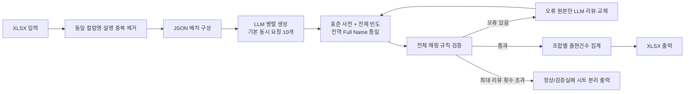

# 컬럼 약어 매핑 API

`data/table_column_template_컬럼코멘트Y.xlsx`의 `컬럼명 (*)`, `컬럼설명`을 읽어 로컬 LLM으로 영문약어·영문 Full Name·한글단어를 추출하고, 검증 및 LLM 리뷰 루프를 거친 뒤 4개 컬럼의 XLSX 파일을 반환하는 FastAPI 서비스입니다.

## 워크플로우



동일한 컬럼명·설명은 한 번만 생성한 뒤 모든 원본행에 복제합니다. 대표 컬럼을
기본 25개씩 JSON으로 묶고, 최대 10개 요청을 동시에 보냅니다. 두 값은 API 폼
필드 또는 환경변수로 조정할 수 있습니다.

## 실행

Python 3.11 이상이 필요합니다.

```bash
python -m venv .venv
pip install -e ".[dev]"
uvicorn app.main:app --host 0.0.0.0 --port 8002
```

로컬 LLM 기본값은 사용자 제공 엔드포인트와 모델로 설정되어 있습니다.
다른 값은 `.env.example`의 환경변수를 프로세스 환경에 설정합니다.
비동기 작업 결과는 기본적으로 `results/{job_id}.xlsx`에 저장되며,
`RESULTS_DIR` 환경변수로 저장 디렉터리를 변경할 수 있습니다.
`약어요약.xlsx`는 기본 표준 사전으로 로드되며
`CANONICAL_GLOSSARY_PATH`로 다른 XLSX 사전을 지정할 수 있습니다.

느린 로컬 LLM을 고려해 연결 timeout은 15초, 응답 읽기 timeout은 1800초(30분)로
분리되어 있습니다. `LLM_READ_TIMEOUT_SECONDS`로 응답 대기 시간을 조정할 수
있으며, 이전 `LLM_TIMEOUT_SECONDS` 환경변수도 읽기 timeout으로 호환됩니다.

## 진행률을 표시하는 API 호출

긴 작업에는 비동기 작업 API를 권장합니다. 먼저 파일을 업로드하고 `job_id`를
받습니다.

```bash
JOB_ID=$(
  curl -s -X POST "http://localhost:8002/v1/abbreviation-mappings/jobs" \
    -F "file=@table_column_template.xlsx" \
    -F "batch_size=25" \
    -F "max_concurrency=10" \
    -F "max_review_rounds=2" |
  jq -r '.job_id'
)
```

`curl -N`으로 버퍼링 없이 단계별 진행률, 단계 누적시간, 전체 소요시간과
중간 건수를 확인합니다.
LLM 응답을 기다리는 동안에도 기본 15초마다 `연결 유지` 메시지가 출력되므로
프록시나 클라이언트의 유휴 연결 timeout을 방지합니다.

```bash
curl -N "http://localhost:8002/v1/abbreviation-mappings/jobs/${JOB_ID}/progress"
```

표시 예시:

```text
[입력       ] [██████████████████████████████] 100% (전체   5%) | 입력 컬럼 1,889건을 읽었습니다. | 단계 누적 00:01.2 · 전체 소요 00:01.2
[LLM 생성   ] [██████████░░░░░░░░░░░░░░░░░░]  33% (전체  23%) | 배치 20/60 완료 · 후보 1,042건 | 단계 누적 04:18.7 · 전체 소요 04:19.9
[전역 표준화] [██████████████████████████████] 100% (전체  65%) | 전역 표준화 완료 · 사전 교정 191건 · 다수결 교정 12건 | 단계 누적 00:00.2 · 전체 소요 12:50.9
[검증       ] [██████████████████████████████] 100% (전체  70%) | 오류 3건 · 경고 8건 | 단계 누적 00:00.4 · 전체 소요 12:51.3
[LLM 리뷰   ] [███████████████░░░░░░░░░░░░░░]  50% (전체  71%) | 1차 리뷰 배치 1/2 완료 · 교체 후보 22건 | 단계 누적 02:03.1 · 전체 소요 14:54.4
[XLSX 출력  ] [██████████████████████████████] 100% (전체 100%) | XLSX 생성 완료 · 매핑 744건 | 단계 누적 00:01.8 · 전체 소요 17:02.5

단계별 소요시간
- 대기: 00:00.1
- 입력: 00:01.2
- LLM 생성: 12:49.7
- 전역 표준화: 00:00.4
- 검증: 00:00.8
- LLM 리뷰: 04:09.0
- XLSX 출력: 00:01.8
- 전체: 17:02.6
```

리뷰 최대 횟수 뒤에도 일부 검증 오류가 남으면 작업을 실패 처리하지 않고 부분 결과를
저장합니다. 정상 항목은 `약어_매핑` 시트에 집계하고, 통과하지 못한 항목은
`검증실패` 시트에 원본 컬럼, 현재 매핑, 오류코드, 검증결과와 구체적인 수정방법을 기록합니다.
Full Name 충돌은 표준 사전값 또는 전체 원본의 다수값으로 먼저 통일하며, 끝까지
남은 충돌에서도 권고값과 다른 소수 후보만 실패 항목으로 분리합니다.

현재 상태와 JSON 중간 결과가 필요하면 다음 엔드포인트를 사용합니다.

```bash
curl "http://localhost:8002/v1/abbreviation-mappings/jobs/${JOB_ID}" | jq
```

상태 응답의 `timing.total_elapsed_seconds`에서 전체 소요시간을,
`timing.stage_durations_seconds`에서 단계별 누적 소요시간을 초 단위로 확인할 수
있습니다. 검증·LLM 리뷰가 여러 차례 실행되면 같은 단계의 시간이 합산됩니다.
완료된 파일 경로는 `result_metadata.result_path`, 부분 결과 여부는
`result_metadata.is_partial`, 검증 실패 원본 수는
`result_metadata.failed_source_count`에서 확인합니다. 표준 사전 및 다수결로
교정된 후보 수는 `result_metadata.reconciliation_stats`에 기록됩니다.

```bash
curl -s "http://localhost:8002/v1/abbreviation-mappings/jobs/${JOB_ID}" |
  jq -r '.result_metadata.result_path'
```

비동기 작업의 별도 다운로드 API는 제공하지 않습니다. 서버에서 작업이 완료되면
`results/{job_id}.xlsx` 파일이 생성됩니다.

## 단일 요청 API

```bash
curl -X POST "http://localhost:8002/v1/abbreviation-mappings" \
  -F "file=@table_column_template.xlsx" \
  -F "batch_size=25" \
  -F "max_concurrency=10" \
  -F "max_review_rounds=2" \
  -o 약어매핑.xlsx
```

성공 시 `영문약어`, `영문 Full Name`, `한글단어`, `출현건수`만 포함한 XLSX를
바로 반환합니다. 단일 요청 방식은 서버 처리 중 진행률을 표시하지 않으므로 긴 작업에는
위 비동기 작업 API를 사용합니다. 검증 오류가 리뷰 루프 뒤에도 남으면 정상·실패 시트가
포함된 부분 결과 XLSX를 반환합니다. 입력 XLSX 구조 오류는 422, LLM 호출/JSON 파싱 실패는
502로 반환됩니다.

상태 확인:

```bash
curl http://localhost:8002/health
```

Swagger UI는 `http://localhost:8002/docs`에서 확인할 수 있습니다.

로컬 LLM 연결과 JSON 응답 형식만 빠르게 확인하려면 다음을 실행합니다.

```bash
python scripts/smoke_llm.py
```

## 검증 규칙

- 모든 원본 컬럼이 최소 한 개 매핑으로 커버되는지
- 약어가 대문자 영문으로 시작하는 영문·숫자 형식이며 실제 컬럼명에 존재하는지
- Full Name과 한글단어가 비어 있거나 잘못된 형식인지
- 한글단어가 컬럼설명에서 직접 확인되는지
- Full Name이 표준 사전의 `(영문약어, 한글단어)` 기준과 일치하는지
- 같은 약어·한글단어에 상충하는 Full Name이 할당되었는지
- 동일 원본 내 완전 중복 매핑이 있는지

각 검증 이슈에는 현재 잘못된 값, 기대 조건과 `suggested_action`이 포함됩니다.
리뷰 LLM은 이 수정 지시를 기준으로 약어 교체, Full Name 통일, 컬럼설명에 존재하는
한글단어 선택 또는 누락 매핑 추가를 수행합니다.

## 테스트

테스트는 외부 LLM을 호출하지 않고, 가짜 모델과 임시 표준 사전을 사용해 중복 입력
축약 → 생성 → 전역 표준화 → 검증 → 리뷰 → 재검증 → XLSX 출력 루프를 확인합니다.

```bash
pytest
```
